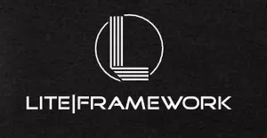

### Description

Lite is a lightweight, yet powerful micro framework designed for small-scale projects and personal use. With seamless integration of essential components like Illuminate Database and Symfony routing, along with built-in template engine support, it offers a hassle-free development experience. Tailored for simplicity and flexibility, Lite enables swift setup and easy management for your personal web development endeavors.

### Installation
1. Install PHP dependencies using composer install.
2. Install frontend dependencies with npm install.
3. Create your database file manually. Ex: storage/database/database.sqlite
5. Create your "cache" folder at root.
4. Create a new .env file (taike .env.example as model).
5. Change your environment variables to suit your need.
DB_DATABASE=storage/database/database.sqlite
APP_URL=http://localhost:8500/
6. Migrate your database (create user table) + seed new users.
7. Configure your server to point to the index.php front controller located in the public folder.
Ex: php -S localhost:8500 -t public
8. Launch the Vite server by running npm run dev.

### Roadmap
#### Features
1. Ready-to-Use Database Integration

Seamlessly integrated Illuminate Database for efficient data management.
Simplified database operations to accelerate development.

2. Robust Routing System

Follows the Model-View-Controller (MVC) pattern for organized and scalable development.
Employs the Symfony routing system for efficient routing and request handling.

3. Streamlined Template Engine

Includes a powerful template engine for enhanced security and clear separation of concerns.
Facilitates the creation of dynamic and appealing web content effortlessly.

4. Hassle-Free Form Validation

Offers built-in form validation for hassle-free data validation and error handling.
Ensures data integrity and user input accuracy for seamless user interactions.

5. Tailwind CSS and Vue.js Integration

Pre-configured Vite setup, working seamlessly with Tailwind CSS and Vue.js.
Empowers efficient frontend development, enabling dynamic and engaging user interfaces.

### Licence
MIT License

Copyright (c) [year] [fullname]

Permission is hereby granted, free of charge, to any person obtaining a copy
of this software and associated documentation files (the "Software"), to deal
in the Software without restriction, including without limitation the rights
to use, copy, modify, merge, publish, distribute, sublicense, and/or sell
copies of the Software, and to permit persons to whom the Software is
furnished to do so, subject to the following conditions:

The above copyright notice and this permission notice shall be included in all
copies or substantial portions of the Software.

THE SOFTWARE IS PROVIDED "AS IS", WITHOUT WARRANTY OF ANY KIND, EXPRESS OR
IMPLIED, INCLUDING BUT NOT LIMITED TO THE WARRANTIES OF MERCHANTABILITY,
FITNESS FOR A PARTICULAR PURPOSE AND NONINFRINGEMENT. IN NO EVENT SHALL THE
AUTHORS OR COPYRIGHT HOLDERS BE LIABLE FOR ANY CLAIM, DAMAGES OR OTHER
LIABILITY, WHETHER IN AN ACTION OF CONTRACT, TORT OR OTHERWISE, ARISING FROM,
OUT OF OR IN CONNECTION WITH THE SOFTWARE OR THE USE OR OTHER DEALINGS IN THE
SOFTWARE.
